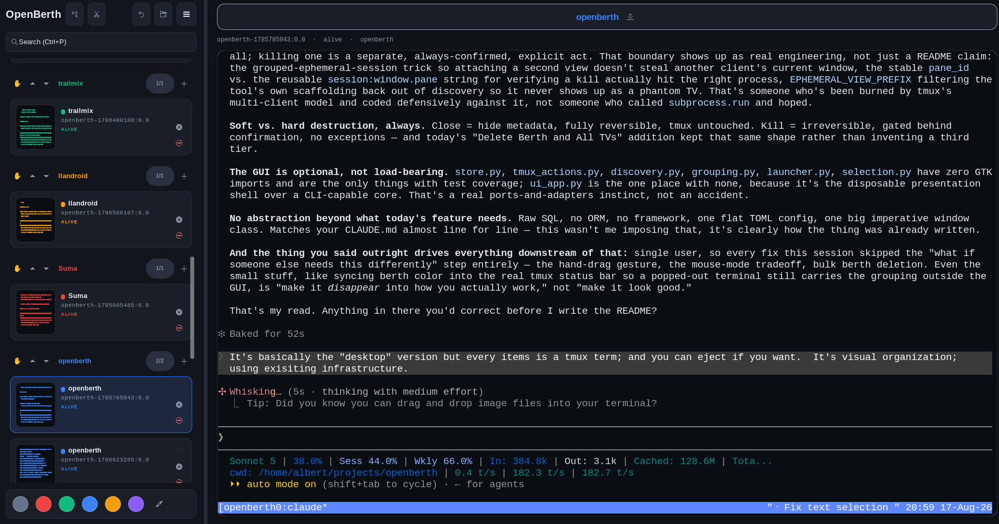

# OpenBerth

The desktop metaphor for tmux. Every icon is a real terminal — organize, launch, and
group your tmux sessions visually, then eject to a real terminal window whenever you
want. No new session manager to trust: tmux stays the source of truth, OpenBerth is
just a way to *see* it.



## Why

Tmux already solves persistence and multiplexing. What it doesn't give you is a way to
*look* at a dozen sessions at once, remember which one was the deploy script versus the
scratch shell, or group related work without memorizing session names. OpenBerth adds
that layer on top — visual organization over infrastructure that already exists,
instead of a new terminal stack to adopt. Nothing here owns your shell processes or
your data: killing a tmux target is the one destructive action, and it always asks
first.

The UI itself is built for speed, not beauty: color and layout exist so what you need
is visually easy to find at a glance, not to look good in a screenshot. Almost
everything — a TV, a berth, the ungrouped section — has a right-click menu with the
full set of actions (rename, recolor, move, pop out, close, kill, copy target,
delete-with-or-without-its-TVs) instead of buttons competing for space in the layout.

## Concept

- A **TV** represents one tmux target (`session:window.pane`).
- A **berth** is a named, color-coded group of TVs.
- The **Harbor** is the left-side list of berths and TVs, with live activity minimaps.
- The right panel embeds a real terminal (VTE) attached to the active TV.
- **Closing** a TV hides it from OpenBerth without touching tmux; **killing** a target
  is destructive and always requires confirmation.
- **Popping out** hands a TV to a real terminal window (wezterm) attached to the same
  tmux target — the session keeps running, and needs no OpenBerth process, whether
  it's popped out or not.

## Features

- tmux discovery with periodic polling and alive/dead status tracking
- Chain-link selected TVs into berths; unlink; drag-and-drop; Photoshop-style
  multi-select (click, Ctrl-toggle, Shift-range)
- Berth color palette + custom picker; colors drive the Harbor accents **and each
  session's tmux status bar**, so popped-out terminals still carry the grouping
- Pick up a berth by its hand icon and carry it anywhere in the list to reorder,
  instead of stepping it one slot at a time
- Cairo-drawn activity minimaps and live text previews from captured pane output
- Embedded VTE terminal with drag-to-edge autoscroll, copy-on-select, and right-click
  paste — tmux owns the mouse, so it behaves like a normal window
  ([caveats](#status-and-caveats))
- Pop out TVs into wezterm windows, docked as tabs per berth
- Search across names, targets, and berths (Ctrl+P); restore closed TVs (Ctrl+Shift+T)
- "Delete Berth" orphans its TVs (ungrouped); "Delete Berth and All TVs" kills them
  first, so cleaning up a berth never leaves stray free-floating TVs behind
- SQLite persistence (`~/.openberth.db`); CLI that works without GTK

## Install

```bash
sudo apt install python3-gi gir1.2-gtk-4.0 gir1.2-vte-3.91 libgtk-4-1 tmux wezterm
/usr/bin/python3 -m pip install --user --break-system-packages .
openberth-install-desktop   # KDE/GNOME launcher entry + icon
```

Use the system Python for the UI — conda/miniconda Pythons do not see the
apt-installed GTK bindings.

## Run

```bash
openberth-ui                # GTK UI
openberth --discover        # CLI, no GTK needed
openberth                   # list known TVs
```

Configuration is read from `~/.openberth.toml` (see [.openberth.toml](.openberth.toml)
for a documented example: theme, fonts, colors, poll interval, terminal command).

## Development

```bash
python3 -m unittest discover -s tests -p "test_*.py"
```

The core (discovery, store, grouping, selection, tmux actions) has no GTK dependency
and is fully unit tested; `ui_app.py` is the GTK presentation layer on top of it.

Docs live in [docs/](docs/): [architecture](docs/architecture.md),
[user model](docs/user-model.md), [UI specification](docs/openberth-specifications.md),
[quickstart](docs/quickstart.md). The original hand-drawn design sketch is in
[assets/ui-mockup.png](assets/ui-mockup.png).

## Status and Caveats

Alpha (0.1.0), and honest about it: this is developed against one setup —
Kubuntu/KDE, GTK4, VTE 0.76, wezterm, tmux 3.4. It will meet your machine in ways
it has not met mine.

**The mouse handoff is the brittle part.** To get drag-to-edge autoscroll and
copy-on-select, attaching a TV sets `mouse on` on that tmux session and unbinds
the root `MouseDown3Pane` binding. Those are writes to *your live tmux server*,
not to a sandbox, and they affect every client attached to that session — not
just OpenBerth. An earlier version of this also set a global `copy-command` and
broke copy/paste across the author's sessions badly enough to kill a running
process. That specific cause is fixed, but the mechanism is inherently invasive:
if you have tmux mouse or copy-mode bindings you care about, try OpenBerth
against a scratch tmux server first (`tmux -L scratch`) before pointing it at
work you cannot lose.

Other things worth knowing:

- `ui_app.py` is the large, untested part of the codebase; the core beneath it
  (discovery, store, grouping, selection, tmux actions) is GTK-free and covered
  by tests.
- State lives at `~/.openberth.db` and `~/.openberth.toml`, not in XDG
  directories.
- The default pop-out terminal is wezterm. Other terminals work via
  `[terminal] command`, but wezterm is the only one exercised regularly.
- Killing a target, and the skull-icon purge, are the only destructive actions.
  Both confirm first; the purge confirms twice.

## License

[MIT](LICENSE.md)
